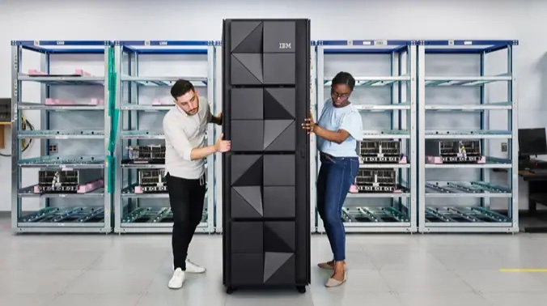

# Enabling Smarter Workloads: AI on IBM zSystems and LinuxONE

The IBM zSystems platform excels at processing the most critical enterprise workloads. 

IBM zSystems have continuously evolved to meet the worlds ever growing needs. With the introduction of the [IBM z16](https://newsroom.ibm.com/2022-04-05-Announcing-IBM-z16-Real-time-AI-for-Transaction-Processing-at-Scale-and-Industrys-First-Quantum-Safe-System) this includes an on-chip AI accelerator which enables workloads to be infused with AI at throughput rates and latencies previously unobtainable.

Whether you come here as a beginner or experienced AI practioner, IBM zSystems provide numerous options for getting started with AI.

Within these pages, you'll find information on how to leverage the best of the open source ecosystem on IBM zSystems and LinuxONE, as well as pointers to community edition and freely available software that can help you quickly get started.

IBM zSystems and LinuxONE are, at their core, enterprise platforms. As such, these pages will also contain pointers to informaton on infusing critical business applications with AI. 

This Github 101 page has been created to assist in that enablement by providing use cases, code samples, and other content to serve as a technical resource for your AI on Z journey. 

Use the navigation bar on the left to begin your journey.

