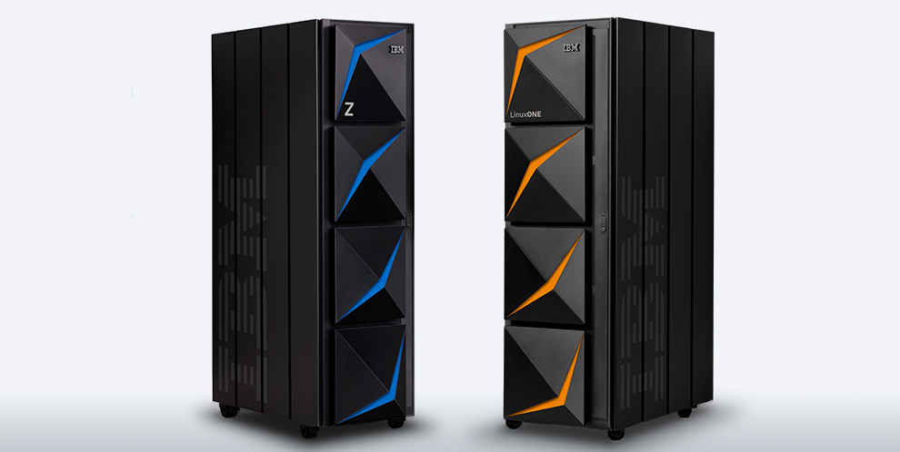

# Enabling Smarter Workloads: AI on Z

The IBM Z platform has been and continues to be a key backbone for processing data globally. 
It has continued to evolve to meet the worlds ever growing needs. With the introduction of the new [Telum Processor](https://www.ibm.com/blogs/systems/ibm-telum-processor-the-next-gen-microprocessor-for-ibm-z-and-ibm-linuxone/) utilizing an onboard AI accelerator on the z16 we can continue to meet those needs by enabling AI infused workloads allowing you to uncover insights at the transaction level, while taking advantage of the speed and depth of the platform. 

This Github 101 page has been created to assist in that enablement by providing use cases, code samples, and other content to serve as a technical resource for your AI on Z journey.