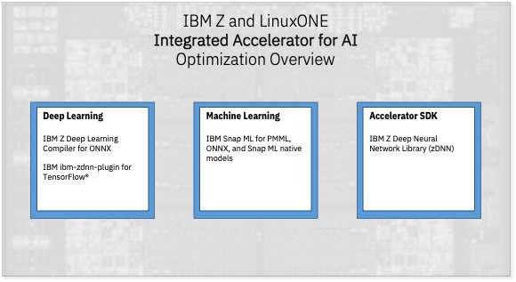

## Leveraging the IBM Integrated Accelerator for AI

The IBM Integrated Accelerator for AI is an on-chip AI accelerator available on the IBM Telum chip that is part of IBM z16 and LinuxONE 4 servers. It is designed to enable high throughput, low latency inference for deep learning and machine learning. 

With IBM z16 and the Integrated Accelerator for AI, you can build and train your models on any platform - including IBM zSystems and LinuxONE. When you are ready to deploy your assets, they will receive transparent acceleration and optimization on IBM zSystems, and will leverage the best available acceleration for the model type.

The IBM Integrated Accelerator for AI is more than just a matrix multiply accelerator - it provides optimization and acceleration for a wide set of complex functions commonly found in deep learning and machine learning models. This enables a broader set of functions to be accelerated on the chip.

The following operations are supported on the accelerator (by machine generation):

| Operation |  z16 or LinuxONE 4 (Telum I) | z17 (Telum II) | 
| --------------------- | :---------------------: | :---------------------: |
| LSTM Activation | Supported | Supported | 
| GRU Activation |  Supported | Supported | 
| Fused Matrix Multiply, Bias op |  Supported | + added transpose, INT8 quantization |
| Fused Matrix Multiply (w/ broadcast) |  Supported | + added transpose, INT8 quantization | 
| Batch Normalization |  Supported | Supported | 
| Fused Convolution, Bias Add, Relu | Supported | Supported |
| L2 Norm |  | Supported |
| Layer Normalization |  | Supported |
| Max Pool 2D |  Supported | Supported |
| Average Pool 2D |  Supported | Supported |
| Softmax |  Supported | Supported |
| Relu |  Supported | Supported |
| Leaky Relu |  | Supported |
| Gelu |  | Supported |
| Tanh |  Supported | Supported |
| Sigmoid |  Supported | Supported |
| Add |  Supported | Supported |
| Subtract |  Supported | Supported |
| Multiply |  Supported | Supported |
| Divide |  Supported | Supported |
| Min |  Supported | Supported |
| Max |  Supported | Supported |
| Log |  Supported | Supported |
| Square root |  | Supported |
| Transform (Tensor) |  | Supported |
| Reduce  |  | Supported |

These allow supporting frameworks to target a significantly larger set of operations to the Integrated Accelerator for AI. 

### Using the Integrated Accelerator for AI

Depending on your model type, there are a few essential approaches to leveraging the Integrated Accelerator for AI. These capabilities are all available in various IBM product offerings as well as through no-cost channels (such as the IBM Z Container Image Repository). 

For deep learning models, such as those created in PyTorch or TensorFlow:

 - [**ONNX deep learning models**](onnxdlc.md), when compiled using the [IBM Z Deep Learning Compiler](https://github.com/ibm/zdlc) (onnx-mlir). 
 - [**TensorFlow**](tensorflow.md) 
 - [**PyTorch**](pytorch.md)
 
For machine learning models, such as those created in sci-kit learn, XGBoost, or lightGBM:

 - [**IBM Snap ML**](snapml.md), a machine learning framework that provides optimized training and inference.
 
For those interested in enhancing frameworks or compilers to use the Integrated Accelerator for AI:

 - [**IBM zDNN**](codingAIU.md)
    - This is the accelerator development library, which is intended for use by those interested in enhancing frameworks or compilers to use the accelerator.  

For further details, use the navigation bar on this page to select a 'Featured Frameworks and Technologies' choice. 

Each of these are available as standalone packages, free of charge, or embedded within IBM products such as  Machine Learning for z/OS and Cloud Pak for Data. 

Further reading:

- [IBM Telum announcement](https://www.ibm.com/blog/ibm-telum-processor-the-next-gen-microprocessor-for-ibm-z-and-ibm-linuxone/)
